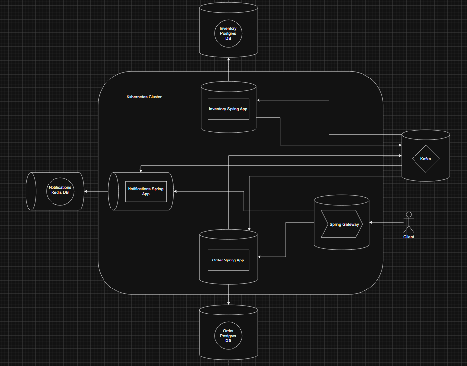

# Sentinel — Distributed Order Processing Platform

Sentinel is a small e-commerce order system built with four independent services that talk to each other through Kafka instead of calling each other directly. A client places an order, Inventory checks and reserves stock (or rejects it), and Notification logs the result.

---

## Why this project exists

This project was built to learn real backend infrastructure — Docker, Kubernetes, Kafka — and to get hands-on Java experience.

---

## Architecture



**Services:**

| Service | What it does | Database | Called directly by the client? |
|---|---|---|---|
| **Order Service** | Accepts orders, tells Kafka an order was created, listens for the result and updates the order's status | PostgreSQL | Yes |
| **Inventory Service** | Listens for new orders, checks stock, tells Kafka whether the order was approved or rejected | PostgreSQL | No — only reacts to Kafka events |
| **Notification Service** | Listens for approved/rejected orders and logs a notification | Redis | Yes (to view notifications) |
| **Spring Gateway** | The single entry point clients talk to; routes requests to Order and Notification | — | — |

**Why Inventory can't be called directly:** if Inventory goes down, the client should never notice. Order Service keeps accepting orders no matter what, and Kafka holds onto the order until Inventory comes back and catches up. This was tested directly — see below.

**Why the databases sit outside Kubernetes:** most real companies don't manage their own databases directly — that's usually handled by a cloud provider or a separate infra team. This project follows the same idea: only the four app services run inside Kubernetes; the databases run separately in Docker.

---

## Event contract

| Event | Sent by | Listened to by |
|---|---|---|
| `order.created` | Order Service | Inventory Service |
| `inventory.reserved` | Inventory Service | Order Service, Notification Service |
| `inventory.rejected` | Inventory Service | Order Service, Notification Service |

Each service keeps its own copy of these event definitions instead of sharing one file between them. This keeps every service independent, but it comes with a real cost: if you add a new value to one service's copy and forget to update another service's copy, the second service will fail when it receives that event. This actually happened during development and is one of the bugs described below.

---

## Resilience & failure handling

A big focus of this project was making sure things fail safely instead of just crashing.

**Tested: what happens if Inventory goes down.** Inventory was stopped on purpose while orders kept coming in. Orders still saved successfully and came back as "pending" right away — the client never saw an error. Once Inventory came back online, it picked up right where it left off and finished processing every order that came in while it was down.

**Retries with increasing wait times.** If a service fails to process a message, it tries again a few times, waiting a little longer each time (1 second, then 2 seconds, up to 10 seconds), before giving up.

**A safety net for messages that keep failing.** If a message still fails after all retries, instead of getting stuck or lost, it gets moved to a separate "dead letter" topic. This was tested by forcing a failure on purpose and confirming the message ended up there instead of disappearing.

**Automatically resolving stuck orders.** If an order ends up in that dead-letter topic, Inventory Service automatically marks it as rejected instead of leaving it stuck forever. Order and Notification Service don't have this same safety net yet — that's a known gap, listed below.

**A bug that was caught through testing.** While testing the failure handling above, a message with a value one service didn't recognize caused that service to get stuck completely — retries and the dead-letter safety net didn't even kick in, because the failure happened before the message could be read at all. The fix was adding a wrapper (`ErrorHandlingDeserializer`) that catches this exact kind of failure and routes it through the same retry/dead-letter system as everything else.

**Kubernetes restarts crashed services automatically.** A service's pod was killed outright to confirm Kubernetes notices and automatically starts a replacement — no manual restart needed.

**Scaling up.** Order Service was scaled to 3 copies running at once to see how traffic spreads across them. Regular requests were shared across all 3 copies, but Kafka message processing wasn't — only 2 of the 3 could actually process messages, because Kafka splits work based on how many "partitions" a topic has, not how many service copies are running. This was a useful, real finding: adding more copies of a service doesn't automatically mean more Kafka throughput.

---

## Secrets management

Database passwords aren't hardcoded anywhere. Each service's real credentials live in a `secret.yaml` file that's excluded from version control, alongside a committed `secret.example.yaml` that shows the expected format without any real values.

**Known limitation:** Kubernetes stores these secrets in a format that's encoded, not encrypted — meaning someone with access to the cluster could technically read them. A real production setup would add proper encryption or use a dedicated secrets tool (like Vault) on top of this.

---

## Infrastructure

**Local development:** Docker Compose runs both Postgres databases, Redis, and Kafka.

**Kubernetes:** all four services run in a local Kubernetes cluster (`kind`), each with automated health checks so Kubernetes knows if a service is working correctly.

**CI/CD:** every time code is pushed to GitHub, it automatically:
1. Runs tests against real Postgres, Kafka, and Redis instances (spun up fresh just for the test, using Testcontainers — not fake/mocked versions)
2. If tests pass, builds a Docker image for each service and publishes it

---

## Tech stack

Java · Spring Boot · Spring Kafka · Apache Kafka · PostgreSQL · Redis · Docker · Kubernetes · GitHub Actions · Testcontainers

---

## Running locally

```bash
# Start the databases and Kafka
docker-compose up -d order-db inventory-db notification-redis kafka

# Build each service's image and load it into the cluster
docker build -t order-service:local ./order-service
kind load docker-image order-service:local --name sentinel
# repeat for inventory-service, notification-service, and gateway

# Deploy everything
kubectl apply -f order-service/k8s/manifest.yaml
kubectl apply -f inventory-service/k8s/manifest.yaml
kubectl apply -f notification-service/k8s/manifest.yaml
kubectl apply -f gateway/k8s/manifest.yaml

# Access the app
kubectl port-forward svc/gateway 8080:8080
```

Then send requests to `http://localhost:8080/orders`, `http://localhost:8080/notifications`, etc.

---

## Known limitations / next steps

- Only Inventory Service automatically recovers from permanently failed messages — Order and Notification Service don't yet.
- Kafka topics only have one partition each, which limits how much a service's Kafka processing can scale, regardless of how many copies are running.
- No real load testing has been done — scaling was checked for correctness, not performance.
- Database credentials are stored securely, but not encrypted at rest — a production setup would add that.
- Databases run outside Kubernetes by design, rather than as part of the cluster itself.